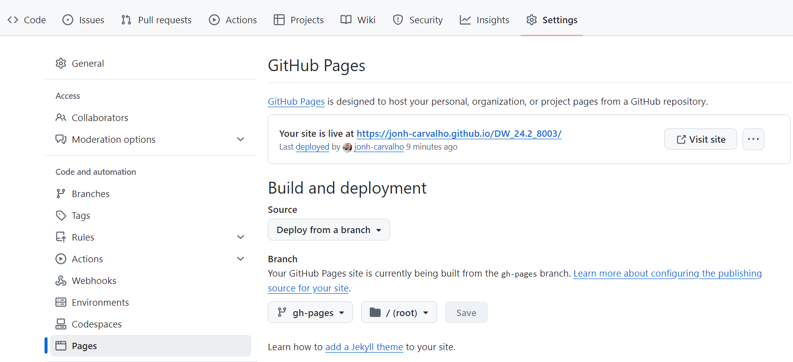

# Avaliações

- ACs

- AP1 - Entrega 25/09/2024 - Envio no Github(Prof. adicionado como colaborador) do aluno Até as 9:20h

- AP2

Todas as atividades de avaliação devem ser publicadas numa pasta /docs. Nessa pasta deverá ser criada as pastas ACs, AP1 e AP2. Após a criação das pastas deve ser feita a configuração do github pages.

- Settings

- Pages

- Em Branch fazer a seleção da pasta /docs para a publicação 

- Salvar 